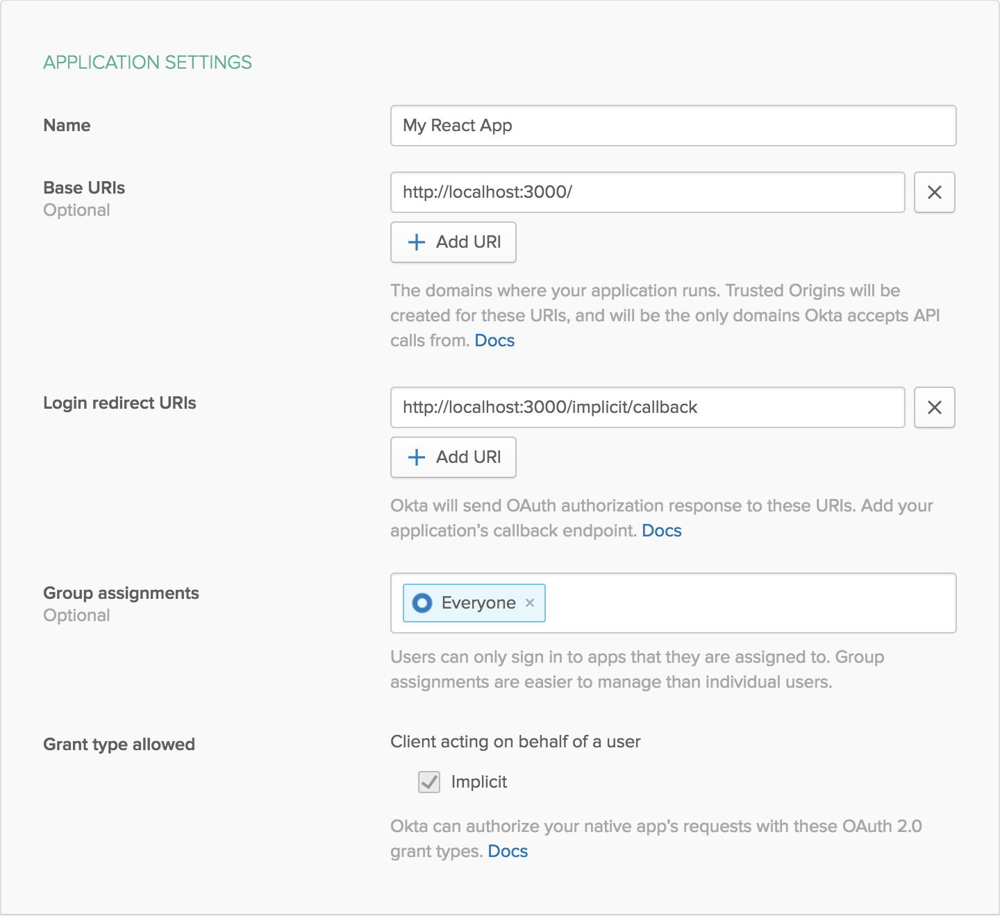

# Example Web App Using Express, React, and GraphQL

This example app shows how to create a GraphQL API in Express and connect it to a React web app, all with secure user authentication using Okta.

This project was bootstrapped with [Create React App](https://github.com/facebookincubator/create-react-app).

**Prerequisites**: [Node.js](https://nodejs.org/en/) and [Yarn](https://yarnpkg.com/lang/en/).

## Getting Started

To install this example application, run the following commands:

```bash
git clone https://github.com/oktadev/okta-graphql-react-express-example.git
cd okta-graphql-react-express-example
yarn
```

This will install a local copy of the project. You will need to set up some environment variables before the app will run properly.

To integrate Okta's Identity Platform for user authentication, you'll first need to:

* [Sign up for a free Okta Developer account](https://www.okta.com/developer/signup/)
* You will get a URL similar to `https://dev-123456.oktapreview.com`.
  * Save this URL for later
  * You will also use this URL to login to your Okta account

You will need to create an application in Okta:

* Log in to your Okta account, then navigate to **Applications** and click the **Add Application** button
* Select **Single-Page App** and click **Next**
* Give your application a name (e.g. "My React App")
* Change the **Base URI** to `http://localhost:3000/` and the **Login redirect URI** to `http://localhost:3000/implicit/callback`, then click **Done**
* Save your **Client ID** for later

Your Okta application should have settings similar to the following:



You will also need to create an API token in Okta:

* Log in to your Okta account, then navigate to **API > Tokens** and click the **Create Token** button
* Enter a name that will help you remember what this is used for (e.g. "GraphQL Express")
* Save the provided **token value** for later
  * This will only be displayed once. If you lose it, you will need to create another API token

Now create a file called `.env.local` in the project root and add the following variables, replacing the values with your own from the previous steps.

**.env.local**
```bash
REACT_APP_OKTA_CLIENT_ID={yourClientId}
REACT_APP_OKTA_ORG_URL=https://{yourOktaOrgUrl}
REACT_APP_OKTA_TOKEN={yourOktaToken}
```

Now you can run both the React frontend and the GraphQL server with the following command:

```bash
yarn start
```

## Links

This example uses the [Okta React SDK](https://github.com/okta/okta-oidc-js/tree/master/packages/okta-react), the [Okta Node SDK](https://github.com/okta/okta-sdk-nodejs), and the [Okta JWT Verifier](https://github.com/okta/okta-oidc-js/tree/master/packages/jwt-verifier).

## Help

Please [raise an issue](https://github.com/oktadeveloper/okta-graphql-react-express-example/issues) if you find a problem with the example application, or visit our [Okta Developer Forums](https://devforum.okta.com/). You can also email [developers@okta.com](mailto:developers@okta.com) if would like to create a support ticket.

## License

Apache 2.0, see [LICENSE](LICENSE).
